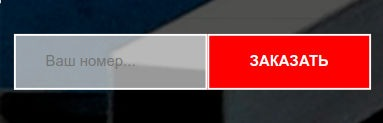

# Deploy: [Link](https://mitrofanzxc.github.io/zikmes-test/) 

### `yarn` 

Install all dependencies. 

### `yarn start` 

Run the app in the development mode. 

## Requirements of the project: 

- [x] Create form with input field and button as in the image: 

 

- [x] Form view on mobile devices: 

 

- [x] Organize a simple field validation (must be filled in); 
- [x] When you click the button, send data from the form to any service (at your discretion) without reloading the page; 
- [x] After receiving a response, display a notification about the result of the request; 
- [x] Organize the assembly of the project using Webpack using the CSS preprocessor and optimizing scripts for older versions of browsers (SCSS, Babel); 
- [x] Include the font-awesome font library in the project assembly (Webpack), add any icon to the button; 
- [x] Commit changes to version control system (git); 
